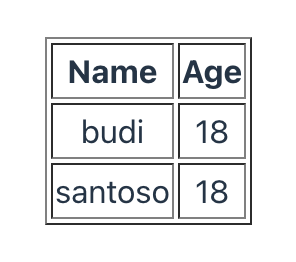

# Primitive Table



This is a simple package for react table.

### Installation

- NPM

```
npm i primitive-table
```

- yarn

```
yarn add primitive-table
```

### Ex usage:

```
import { InitRecordType, Table, TableColumn } from "primitive-table";

interface RecordType extends InitRecordType {
  name: string;
  age: number;
}

const columns: TableColumn<RecordType>[] = [
  {
    label: "Name",
    fnDataIndex: (item) => item.name,
  },
  {
    label: "Age",
    fnDataIndex: (item) => item.age,
  },
];

const records: RecordType[] = [
  {
    name: "budi",
    age: 18,
    key: "1",
  },
  {
    name: "santoso",
    age: 18,
    key: "2",
  },
];
```

Then it could be called like this:

```
<Table columns={columns} tableId="sample" dataSource={records} />
```
